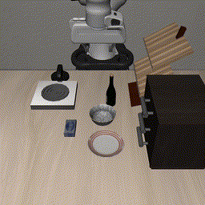
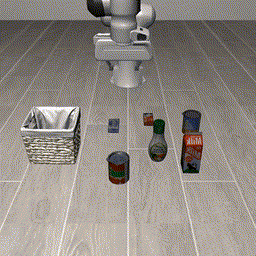
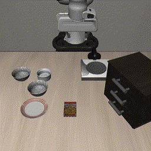
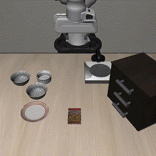
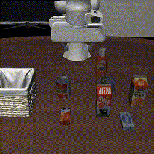
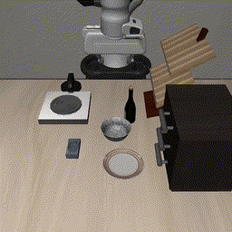
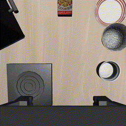
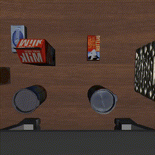
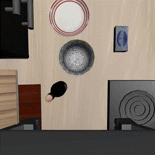

<p align="center">
    
<p>

<h3 align="center"><a href="" style="color:#9C276A">
RynnVLA-002: A Unified Vision-Language-Action and World Model</a></h3>
<h5 align="center"> If our project helps you, please give us a star ⭐ on GitHub to support us. 🙏🙏 </h2>


<h5 align="center">

[](https://arxiv.org/pdf/2511.17502) 
[](https://huggingface.co/Alibaba-DAMO-Academy/RynnVLA-002)
[](./LICENSE) 
</h5>

<div align="center"><video src="https://github.com/user-attachments/assets/a09f6b8b-7707-4478-b069-2de1629c0b83" width="800" autoplay loop muted></div>

## 📰 News

* **[2025.11.10]**  Upgrade WorldVLA to RynnVLA-002. Release models, training code and evaluation code on LIBERO simulation benchmark and real-world LeRobot experiments.
* **[2025.06.23]**  Release models, training code and evaluation code on LIBERO action generation benchmark of WorldVLA.


## 🌟 Introduction
RynnVLA-002 is an autoregressive action world model that unifies action and image understanding and generation. RynnVLA-002 intergrates Vision-Language-Action (VLA) model (action model) and world model in one single framework. Compared to WorldVLA, RynnVLA-002 adds a continous Action Transformer, wrist camera input and generation, and state input. RynnVLA-002 achieves 97.4% success rate on LIBERO benchmark.

<div style="text-align: center;">
  
</div>
<br>

### VLA Model Results (Text + Image -> Action)
VLA model generates actions given the text instruction and image observations.

|         |         |         |  
| :-----: | :-----: | :-----: |  
|  |  |  |
<br>


### World Model Results (Action + Image -> Image)
World Model generates the next frame given the current frame and action control.

|         |         |         |  
| :-----: | :-----: | :-----: |  
|  |  |  |
|  |  |  |
<br>


## 🛠️ Requirements and Installation
```
git clone https://github.com/alibaba-damo-academy/RynnVLA-002.git
cd RynnVLA-002
pip install -r requirements.txt
pip install flash-attn --no-build-isolation
pip install -e .
git clone https://github.com/Lifelong-Robot-Learning/LIBERO.git
cd LIBERO
pip install -e .
```

## :earth_americas: Model Zoo
### VLA Model (256 * 256)

| Model    |    HF Link        |    Continous Action SR (%)     | Discrete Action SR (%) |
| :--------------------: | :------------------------------------------------------------: | :--------------------: | :--------------------: |
| LIBERO-Spatial       | [Alibaba-DAMO-Academy/RynnVLA-002/VLA_model_256/libero_spatial](https://huggingface.co/Alibaba-DAMO-Academy/RynnVLA-002/tree/main/VLA_model_256/libero_spatial) | 99.0 | 94.2 |
| LIBERO-Object       | [Alibaba-DAMO-Academy/RynnVLA-002/VLA_model_256/libero_object](https://huggingface.co/Alibaba-DAMO-Academy/RynnVLA-002/tree/main/VLA_model_256/libero_object) | 99.8 | 96.8 |
| LIBERO-Goal | [Alibaba-DAMO-Academy/RynnVLA-002/VLA_model_256/libero_goal](https://huggingface.co/Alibaba-DAMO-Academy/RynnVLA-002/tree/main/VLA_model_256/libero_goal) | 96.4 | 94.6 |
| LIBERO-Long | [Alibaba-DAMO-Academy/RynnVLA-002/VLA_model_256/libero_10](https://huggingface.co/Alibaba-DAMO-Academy/RynnVLA-002/tree/main/VLA_model_256/libero_10) | 94.4 | 87.6 |
<br>

### World Model (512 * 512)

| *Goal* | HF Link |FVD↓ | PSNR↑ | SSIM↑ | LPIPS↓ |
| :--- | :--- | :--- | :--- | :--- | :--- |
| World Model |[Alibaba-DAMO-Academy/RynnVLA-002/World_model_512/libero_goal](https://huggingface.co/Alibaba-DAMO-Academy/RynnVLA-002/tree/main/World_model_512/libero_goal) | 370.0 | 22.25 | 77.84 | 19.70 |
| Action World Model | [Alibaba-DAMO-Academy/RynnVLA-002/Action_World_model_512/libero_goal](https://huggingface.co/Alibaba-DAMO-Academy/RynnVLA-002/tree/main/Action_World_model_512/libero_goal) | 336.8 | 22.13 | 78.13 | 19.43 |

| *Object* | HF Link | FVD↓ | PSNR↑ | SSIM↑ | LPIPS↓ |
| :--- | :--- | :--- | :--- | :--- | :--- |
| World Model | [Alibaba-DAMO-Academy/RynnVLA-002/World_model_512/libero_object](https://huggingface.co/Alibaba-DAMO-Academy/RynnVLA-002/tree/main/World_model_512/libero_object)| 1141.6 | 20.31 | 59.59 | 27.30 |
| Action World Model | [Alibaba-DAMO-Academy/RynnVLA-002/Action_World_model_512/libero_object](https://huggingface.co/Alibaba-DAMO-Academy/RynnVLA-002/tree/main/Action_World_model_512/libero_object) | 877.2 | 22.18 | 65.03 | 22.60 |

| *Spatial* | HF Link | FVD↓ | PSNR↑ | SSIM↑ | LPIPS↓ |
| :--- | :--- | :--- | :--- | :--- | :--- |
| World Model | [Alibaba-DAMO-Academy/RynnVLA-002/World_model_512/libero_spatial](https://huggingface.co/Alibaba-DAMO-Academy/RynnVLA-002/tree/main/World_model_512/libero_spatial)| 405.4 | 22.32 | 79.15 | 20.28 |
| Action World Model | [Alibaba-DAMO-Academy/RynnVLA-002/Action_World_model_512/libero_spatial](https://huggingface.co/Alibaba-DAMO-Academy/RynnVLA-002/tree/main/Action_World_model_512/libero_spatial)| 373.1 | 23.88 | 82.41 | 16.33 |

| *Long* | HF Link | FVD↓ | PSNR↑ | SSIM↑ | LPIPS↓ |
| :--- | :--- | :--- | :--- | :--- | :--- |
| World Model | [Alibaba-DAMO-Academy/RynnVLA-002/World_model_512/libero_10](https://huggingface.co/Alibaba-DAMO-Academy/RynnVLA-002/tree/main/World_model_512/libero_10)| 557.73 | 18.24 | 69.16 | 31.60 |
| Action World Model | [Alibaba-DAMO-Academy/RynnVLA-002/Action_World_model_512/libero_10](https://huggingface.co/Alibaba-DAMO-Academy/RynnVLA-002/tree/main/Action_World_model_512/libero_10) | 427.86 | 19.36 | 72.19 | 27.78 |


## 🗝️ VLA Model Training on LIBERO
We evaluate four tasks of the LIBERO benchmark, including [spatial, obejct, goal, 10]. Here we take LIEBRO goal and 256 resolution as an example.

We offer two types of training pipelines:

- `Pretokenize`: This pipeline preprocesses all the training data by tokenizing it into tokens before the training begins.
- `NoPretokenize`: This pipeline performs tokenization dynamically during the training process.

Both pipelines begin by filtering out no-operation actions like [OpenVLA](https://github.com/openvla/openvla).

```bash
cd rynnvla-002/libero_util
python regenerate_libero_dataset_filter_no_op.py \
    --libero_task_suite libero_goal \
    --libero_raw_data_dir ../processed_data/Libero/libero_goal \
    --libero_target_dir ../processed_data/libero_goal_no_noops_t_256 \
    --image_resolution 256
```

After filtering, you can choose between the `Pretokenize` or `NoPretokenize` training pipeline. The `Pretokenize` pipeline offers faster training speeds, while the `NoPretokenize` option eliminates the need for preprocessing.

#### Step 0: Download the Chameleon weights
Download the Chameleon [tokenizer](https://huggingface.co/Alibaba-DAMO-Academy/WorldVLA/tree/main/chameleon/tokenizer), [base-model](https://huggingface.co/Alibaba-DAMO-Academy/WorldVLA/tree/main/base_model) and [starting point](https://huggingface.co/Alibaba-DAMO-Academy/WorldVLA/tree/main/chameleon/starting_point) weights, put them under the `rynnvla-002/ckpts/chameleon/tokenizer`, `rynnvla-002/ckpts/chameleon/base_model`, and `rynnvla-002/ckpts/starting_point`.


### Pipeline1: Pretokenize

#### Step 1: Libero Data Preparation

After filtering out no-operation actions, save all images and actions.
```bash
python regenerate_libero_dataset_save_img_action_state_wrist.py \
    --libero_task_suite libero_goal \
    --image_resolution 256 \
    --raw_data_dir ../processed_data/libero_goal_no_noops_t_256 \
    --save_dir ../processed_data/libero_goal_image_state_action_t_256
``` 
Next, generate the conversations data for the Chameleon model. The VLA model conversations are in the following format:
```json
{
  "conversations": [
    {
      "from": "human",
      "value": "What action should the robot take to open the middle drawer of the cabinet?<|state|><|image|><|image|><|image|><|image|>"
    },
    {
      "from": "gpt",
      "value": "<|action|><|action|><|action|><|action|><|action|>"
    }
  ],
  "image": [
    "../processed_data/libero_goal_image_state_action_t_256/open_the_middle_drawer_of_the_cabinet/trj_0/imgs_third_view/image_0.png",
    "../processed_data/libero_goal_image_state_action_t_256/open_the_middle_drawer_of_the_cabinet/trj_0/imgs_wrist/image_0.png",
    "../processed_data/libero_goal_image_state_action_t_256/open_the_middle_drawer_of_the_cabinet/trj_0/imgs_third_view/image_1.png",
    "../processed_data/libero_goal_image_state_action_t_256/open_the_middle_drawer_of_the_cabinet/trj_0/imgs_wrist/image_1.png"
  ],
  "action": [
    "../processed_data/libero_goal_image_state_action_t_256/open_the_middle_drawer_of_the_cabinet/trj_0/action/action_1.npy",
    "../processed_data/libero_goal_image_state_action_t_256/open_the_middle_drawer_of_the_cabinet/trj_0/action/action_2.npy",
    "../processed_data/libero_goal_image_state_action_t_256/open_the_middle_drawer_of_the_cabinet/trj_0/action/action_3.npy",
    "../processed_data/libero_goal_image_state_action_t_256/open_the_middle_drawer_of_the_cabinet/trj_0/action/action_4.npy",
    "../processed_data/libero_goal_image_state_action_t_256/open_the_middle_drawer_of_the_cabinet/trj_0/action/action_5.npy"
  ],
  "state": [
    "../processed_data/libero_goal_image_state_action_t_256/open_the_middle_drawer_of_the_cabinet/trj_0/eef_gripper_state/eef_gripper_state_1.npy"
  ]
}
```
The world model conversations are in the following format:
```json
{
  "conversations": [
    {
        "from": "human",
        "value": "Generate the next image based on the provided sequence of historical images and corresponding actions.<|image|><|image|><|action|>"
    },
    {
        "from": "gpt",
        "value": "<|image|><|image|>"
    }
  ],
  "image": [
    "../processed_data/libero_goal_image_state_action_t_256/open_the_middle_drawer_of_the_cabinet/trj_0/imgs_third_view/image_0.png",
    "../processed_data/libero_goal_image_state_action_t_256/open_the_middle_drawer_of_the_cabinet/trj_0/imgs_wrist/image_0.png",
    "../processed_data/libero_goal_image_state_action_t_256/open_the_middle_drawer_of_the_cabinet/trj_0/imgs_third_view/image_1.png",
    "../processed_data/libero_goal_image_state_action_t_256/open_the_middle_drawer_of_the_cabinet/trj_0/imgs_wrist/image_1.png"
  ],
  "action": [
    "../processed_data/libero_goal_image_state_action_t_256/open_the_middle_drawer_of_the_cabinet/trj_0/action/action_0.npy"
  ]
},
```
To validate the world model performance, we split all the libero dataset into train/val_ind/val_ood json files.
```bash
cd rynnvla-002/data
python action_state_model_conv_generation.py \
    --base_dir ../processed_data/libero_goal_image_state_action_t_256 \
    --his 2 \
    --len_action 5 \
    --task_name goal \
    --resolution 256 \
    --with_state \
    --img_names imgs_third_view imgs_wrist \
    --output_dir ../processed_data/convs
python world_model_bi_views_conv_generation.py \
    --base_dir ../processed_data/libero_goal_image_state_action_t_256 \
    --his 1 \
    --task_name goal \
    --resolution 256 \
    --output_dir ../processed_data/convs
```
Finally, tokenize all the conversations into tokens and save them.
```bash
cd rynnvla-002/data
python pretoken_state_action_model.py --task goal --resolution 256 --with_state --img_names imgs_third_view imgs_wrist --his 2 --len_action 5 --tokenizer_path ../ckpts/models--Alpha-VLLM--Lumina-mGPT-7B-768/snapshots/9624463a82ea5ce814af9b561dcd08a31082c3af
python pretoken_world_model.py --task goal --resolution 256 --img_name imgs_third_view imgs_wrist --tokenizer_path ../ckpts/models--Alpha-VLLM--Lumina-mGPT-7B-768/snapshots/9624463a82ea5ce814af9b561dcd08a31082c3af
bash concate_record_libero.sh
python concate_action_world_model_data_libero.py --source_dir_patterns libero_goal_his_2_{}_third_view_wrist_w_state_5_256 libero_goal_his_1_{}_third_view_wrist_a2i_256 --all_patterns libero_goal_his_2_third_view_wrist_w_state_5_256_abiw
```

#### Step 2: Prepare data configs
Set the correct data path in the config files in `rynnvla-002/configs/libero_goal/his_2_third_view_wrist_w_state_5_256_pretokenize.yaml`.

#### Step 3: Start training
Now you can start training with your training scripts:
```bash
# Libero goal, 256 resolution
cd rynnvla-002/exps_pretokenize
bash libero_goal_his_2_third_view_wrist_w_state_5_256_abiw.sh
```


### Pipeline2: NoPretokenize
#### Step 1: Prepare data configs
Set the correct data path in the config files in `rynnvla-002/configs/libero_goal/his_2_third_view_wrist_w_state_5_256_nopretokenize.yaml`.

#### Step 2: Start training
```bash
# Libero goal, 256 resolution
cd rynnvla-002/exps_nopretokenize
bash libero_goal_his_2_third_view_wrist_w_state_5_256_abiw.sh
```


## ✅ VLA Model Evaluation on LIBERO
### Step 1: Prepare evaluation scripts
Set the `checkpoint_path` in the bash files in `rynnvla-002/evals_libero/` to the model path. You can download our trained in Model Zoo or train yourself.

### Step 2: Start evaluation
```bash
# Libero goal, 256 resolution, continous
cd rynnvla-002/evals_libero
bash eval_libero_goal_his_2_third_view_wrist_w_state_5_256_abiw_continous.sh
# Libero goal, 256 resolution, discrete
cd rynnvla-002/evals_libero
bash eval_libero_goal_his_2_third_view_wrist_w_state_5_256_abiw_discrete.sh
```


## 🗝️ World Model Training on LIBERO
For world model training, we set image_resolution to 512.
### Pipeline1: Pretokenize
#### Step 1: Libero Data Preparation

Preprocess the dataset as described above, ensuring the `image_resolution` is set to 512.
Finally, run the following command to concatenate tokens:
```bash
python concate_action_world_model_data_libero.py --source_dir_patterns libero_goal_his_1_train_third_view_wrist_a2i_512 --all_patterns libero_goal_his_1_train_third_view_wrist_a2i_512
```


#### Step 2: Prepare data configs
Set the correct data path in the config files in `rynnvla-002/configs/libero_goal/his_1_third_view_wrist_512_only_worldmodel_pretokenize.yaml`.

#### Step 3: Start Training
```
cd rynnvla-002/exps_libero_world_model
bash libero_goal_his_1_third_view_wrist_512_pretokenize.sh
```

### Pipeline2: NoPretokenize
First, set the correct data path in the config files in `rynnvla-002/configs/libero_goal/his_1_train_third_view_wrist_512_only_worldmodel_nopretokenize.yaml`.

Then, start training:
```
cd rynnvla-002/exps_libero_world_model
bash libero_goal_his_1_third_view_wrist_512_nopretokenize.sh
```

## ✅ World Model Evaluation on LIBERO
We evaluate the world model performance on the valiation set, which is stored in `rynnvla-002/exps_libero_world_model/goal_val_ind_trajectory_paths.json`. If the path is not the same as yours, use `rynnvla-002/exps_libero_world_model/extract_world_model_val_ind_trj.py` to generate one. Then run the evaluation:
```
cd rynnvla-002/exps_libero_world_model
bash eval_world_model_goal.sh
```
Then calculate the generation performance of world model and action world model:
```
python calculate_world_model_performance.py \
    --folder_world_model "" \
    --folder_action_world_model ""
```

## 🗝️ Training on LeRobot

#### Step 1: Lerobot to HDF5

We use HDF5 format data. Therefore, if you collect data in Lerobot format, you can follow the following command to process it into HDF5 format:
```
cd rynnvla-002/data_lerobot
python lerobot_to_hdf5.py \
    --lerobot_input_dir {lerobot_input_dir}
    --hdf5_output_dir {hdf5_output_dir}
```

#### Step 2: HDF5 to raw data
Put all HDF5 files in a json file, see `rynnvla-002/data_lerobot/modified_data_final.json` as an example. Extract the raw front camera data, wrist camera data, state data, and action data and save them all:
```
cd rynnvla-002/data_lerobot
python extract_all_data.py \
    --json_path {json_path}
    --output_dir {raw_data_output_dir}
    --num_processes {num_processes to accelerate}
```

#### Step 3: Generate conversation files
Generate the VLA model conversation file and world model conversation file:
```
cd rynnvla-002/lerobot_util
python action_model_conv_generation_w_2_abs_state_all_data.py --input_dir {raw_data_output_dir} --his 1 --len_action 20 --task_name vla_data --output_dir {conv_output_dir}
python world_model_conv_generation_w_2_abs_front_all_data.py --input_dir {raw_data_output_dir} --his 1 --task_name world_model_data --output_dir {conv_output_dir}
python world_model_conv_generation_w_2_abs_wrist_all_data.py --input_dir {raw_data_output_dir} --his 1 --task_name world_model_data --output_dir {conv_output_dir}
```

#### Step 4: Tokenize raw data based on conversation files
First, calculate the min and max value of action data and state data:
```
cd rynnvla-002/data_lerobot
python calculate_min_max_all_data_state.py {raw_data_output_dir}
python calculate_min_max_all_data_action.py {raw_data_output_dir}
```
Put the results at the beginning of `rynnvla-002/data_lerobot/item_processor.py`  
Then, tokenize all training data and concate them:
```
python pretoken_lerobot_state.py \
    --input_file {conv_output_dir}/libero_vla_data_his_1_train_img_state_abs_ck_1_256.json \
    --output_dir {raw_data_output_dir}/tokens/vla_data \
    --resolution 256 \
    --tokenizer_path ../ckpts/models--Alpha-VLLM--Lumina-mGPT-7B-768/snapshots/9624463a82ea5ce814af9b561dcd08a31082c3af
python -u concate_record.py --sub_record_dir {raw_data_output_dir}/tokens/vla_data --save_path {raw_data_output_dir}/tokens/vla_data/record.json
python pretoken_lerobot.py \
    --input_file {conv_output_dir}/libero_world_model_data_his_1_train_a2i_512_abs_front_all_data.json \
    --output_dir {raw_data_output_dir}/tokens/world_model_data_front \
    --resolution 256 \
    --tokenizer_path ../ckpts/models--Alpha-VLLM--Lumina-mGPT-7B-768/snapshots/9624463a82ea5ce814af9b561dcd08a31082c3af
python -u concate_record.py --sub_record_dir {raw_data_output_dir}/tokens/world_model_data_front --save_path {raw_data_output_dir}/tokens/world_model_data_front/record.json
python pretoken_lerobot.py \
    --input_file {conv_output_dir}/libero_world_model_data_his_1_train_a2i_512_abs_wrist_all_data.json \
    --output_dir {raw_data_output_dir}/tokens/world_model_data_wrist \
    --resolution 256 \
    --tokenizer_path ../ckpts/models--Alpha-VLLM--Lumina-mGPT-7B-768/snapshots/9624463a82ea5ce814af9b561dcd08a31082c3af
python -u concate_record.py --sub_record_dir {raw_data_output_dir}/tokens/world_model_data_wrist --save_path {raw_data_output_dir}/tokens/world_model_data_wrist/record.json
python concate_multi_record.py \
    --input_files {raw_data_output_dir}/tokens/vla_data/record.json {raw_data_output_dir}/tokens/world_model_data_front/record.json {raw_data_output_dir}/tokens/world_model_data_wrist/record.json \
    --output_file {raw_data_output_dir}/concate_tokens/lerobot_all.json
```

#### Step 5: Prepare data configs
Set the correct data path in the config files in `rynnvla-002/configs/lerobot/his_1_third_view_wrist_w_state_20_256_pretokenize.yaml`.

#### Step 6: Start training
Now you can start training with your training scripts:
```bash
cd rynnvla-002/exps_pretokenize
bash libero_goal_his_2_third_view_wrist_w_state_5_256_abiw.sh
```

## ✅ Inference using LeRobot
We provide the action generation function in `rynnvla-002/eval_solver_lerobot_action_head_state.py` and initilization script in `rynnvla-002/evals_lerobot/eval_7B_lerobot_action_head.sh`.


## License <a name="license"></a>

All assets and code are under the [Apache 2.0 license](./LICENSE) unless specified otherwise.

## Citation <a name="citation"></a>
If you find the project helpful for your research, please consider citing our paper:
```bibtex
@article{cen2025rynnvla,
  title={RynnVLA-002: A Unified Vision-Language-Action and World Model},
  author={Cen, Jun and Huang, Siteng and Yuan, Yuqian and Li, Kehan and Yuan, Hangjie and Yu, Chaohui and Jiang, Yuming and Guo, Jiayan and Li, Xin and Luo, Hao and Wang, Fan and Wang, Fan and Zhao, Deli},
  journal={arXiv preprint arXiv:2511.17502},
  year={2025}
}

@article{cen2025WorldVLA,
  title={WorldVLA: Towards Autoregressive Action World Model},
  author={Cen, Jun and Yu, Chaohui and Yuan, Hangjie and Jiang, Yuming and Huang, Siteng and Guo, Jiayan and Li, Xin and Song, Yibing and Luo, Hao and Wang, Fan and Zhao, Deli and Chen, Hao},
  journal={arXiv preprint arXiv:},
  year={2025}
}
```

<details open><summary>💡 Other featured projects from our RynnBot family ✨. </summary><p>
    
<!--  may -->
> [**RynnVLA-001: A Vision-Language-Action Model Boosted by Generative Priors**](https://github.com/alibaba-damo-academy/RynnVLA-001) <br>
> Yuming Jiang, Siteng Huang, Shengke Xue, Yaxi Zhao, Jun Cen, Sicong Leng, Jiayan Guo, Kexiang Wang, Kehan Li, Mingxiu Chen, Fan Wang, Deli Zhao, Xin Li <br>
[](https://github.com/alibaba-damo-academy/RynnVLA-001)  [](https://github.com/alibaba-damo-academy/RynnVLA-001)  [](https://arxiv.org/abs/2509.15212)<be>


> [**RynnRCP: Open Robotics Context Protocol and RobotMotion**](https://github.com/alibaba-damo-academy/RynnRCP) <br>
> RynnBot Team <br>
[](https://github.com/alibaba-damo-academy/RynnRCP)  [](https://github.com/alibaba-damo-academy/RynnRCP)  <br>

> [**RynnMotion: All-In-One Tookit for Fast Robot Prototyping and Heterogeneous Teleoperation**](https://github.com/alibaba-damo-academy/RynnMotion) <br>
> RynnBot Team <br>
[](https://github.com/alibaba-damo-academy/RynnMotion)  [](https://github.com/alibaba-damo-academy/RynnMotion)  <br>


> [**RynnEC: Bringing MLLMs into Embodied World**](https://github.com/alibaba-damo-academy/RynnEC) <br>
> Ronghao Dang*, Yuqian Yuan*, Yunxuan Mao*, Kehan Li*, Jiangpin Liu, Zhikai Wang, Fan Wang, Deli Zhao, Xin Li <br>
[](https://github.com/alibaba-damo-academy/RynnEC)  [](https://github.com/alibaba-damo-academy/RynnEC) [](https://arxiv.org/abs/2508.14160) <be> 


</p></details>

## Acknowledgment <a name="acknowledgment"></a>
This project builds upon [Lumina-mGPT](https://github.com/Alpha-VLLM/Lumina-mGPT), [Chemeleon](https://github.com/facebookresearch/chameleon), and [OpenVLA](http://github.com/openvla/openvla). We thank these teams for their open-source contributions.
